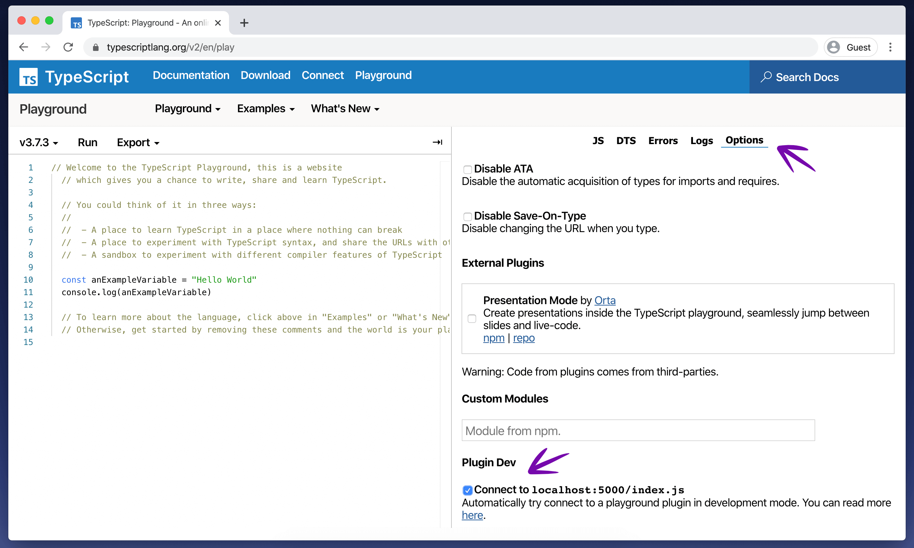
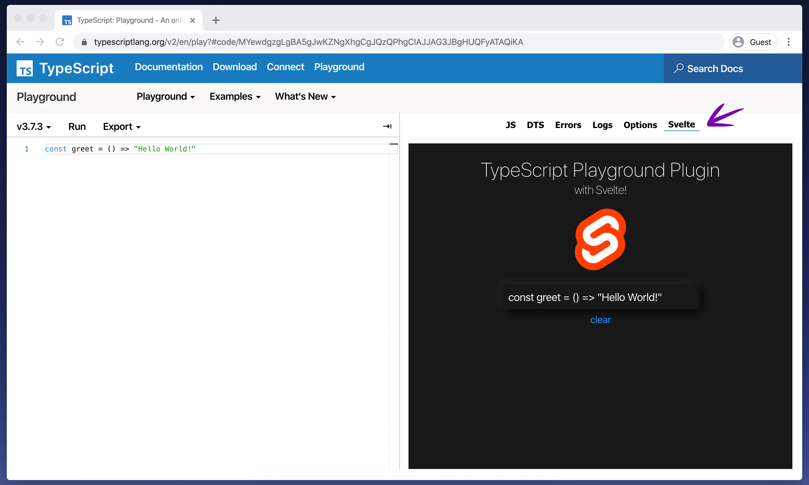

# typescript-playground-plugin-svelte

Easily create TypeScript [Playground Plugins](https://www.typescriptlang.org/v2/dev/playground-plugins/) with [Svelte](https://svelte.dev/).

> 🚧 This project is experimental. If you have any ideas on how to improve this library, any contributions are welcomed. Also, TypeScript Playground plugins currently only work in Chromium based browsers.

Prefer React? Check out [https://github.com/gojutin/typescript-playground-plugin-react](https://github.com/gojutin/typescript-playground-plugin-react).

## Table Of Contents

1. [About](#about)
2. [Getting Started](#getting-started)
3. [Props](#props)
4. [Styling Your Plugin](#styling-your-plugin)
5. [More about TypeScript Playground Plugins](#more-about-typescript-playground-plugins)

## About

The TypeScript Playground V2 comes packed with lots of new features, including the ability to create plugins. Per the TypeScript docs:

> The new TypeScript Playground allows people to hook into the Playground and extend it in ways in which the TypeScript team don't expect.
>
> The sidebar of the Playground uses the same plugin infrastructure as external plugins, so you have the same level of access as the playground to build interesting projects.
>
> Playground plugins have no fancy frameworks, you're free to inject them at runtime and use them if you need to - but the current plugins are built with the DOM APIs and TypeScript.

Since Svelte can be compiled down to dependency-free JavaScript classes, it offers a great, declarative alternative to writing imperative markup with the DOM APIs. This library allows you to use Svelte as a replacement or addition to the DOM APIs to create a rich, interactive UI for your plugin.

## Getting Started

#### Step 1. Clone this repo and navigate to the directory

```sh
git clone git@github.com:gojutin/typescript-playground-plugin-svelte.git
```

```sh
cd typescript-playground-plugin-svelte
```

#### Step 2. Download dependencies

```sh
npm install
```

#### Step 3. Start the development server

```sh
npm start
```

This will start a development server in watch mode. As you edit any files in the `src` directory, the app will recompile and update `dist/index.js`, which is the file that is served to the TypeScript Playground.

> _Note: This does not reload the browser when your files change. In order to see your changes, the browser will need to be manually reloaded each time you make changes to the plugin._

#### Step 4. Configure and use your plugin

You can further customize your plugin by modifying the `customPlugin` object in `src/index.ts`. For instance, you can change the `displayName` property to change the label of the tab for your plugin. See the `PlaygroundPlugin` interface in `vendor/playground.d.ts` for all of the available options.

Visit [https://www.typescriptlang.org/v2/en/play](https://www.typescriptlang.org/v2/en/play).

Select the **Options** tab and tick the box for **Connect to localhost:5000/index.js**.



Now, **refresh the browser**. When the playground reeoads, a new tab with your plugin should appear! 🎉



## Props

The TypeScript Playground Plugin API provides lifecycle methods that are used to interact with the playground. This library uses a combination of [writable store objects](https://svelte.dev/tutorial/writable-stores) and functions to provide the values and methods provided by these lifecycle methods to the Svelte app via props. The following props are provided to your Svelte app:

### **code**

*Writable store*

```typescript
string
```

> Although this is writable store value, you don't want to write to it. See `setCode` and `formatCode` below.

The current code in the Monaco editor. This value updates on change to the Monaco editor with optional debouncing. Uses `sandbox.getText()`.

### **setCode**

*function*

```typescript
(code: string, options: {format: boolean}) => void
```

Set the code in the Monaco editor with optional formatting. Uses `sandbox.setText()`.

### **formatCode**

*function*

```typescript
() => void
```

Format the code in the Monaco editor. Alias for `sandbox.editor.getAction("editor.action.formatDocument").run()`.

### **markers**

*Readable store*

```typescript
IMarker[]
```

Alias for `sandbox.monaco.editor.getModelMarkers({})`. Kept in sync via `sandbox.editor.onDidChangeModelDecorations`.

Here is the [type definition](https://github.com/Microsoft/monaco-editor/blob/master/monaco.d.ts#L875) for `IMarker`:

```typescript
interface IMarker {
  owner: string;
  resource: Uri;
  severity: MarkerSeverity;
  code?:
    | string
    | {
        value: string;
        link: Uri;
      };
  message: string;
  source?: string;
  startLineNumber: number;
  startColumn: number;
  endLineNumber: number;
  endColumn: number;
  relatedInformation?: IRelatedInformation[];
  tags?: MarkerTag[];
}
```

### **setDebounce**

*function*

```typescript
(debounce: boolean) => void
```
Optionally debounce the `modelChange` event from the Plugin API. Per the Plugin docs, this is run on a delay and may not fire on every keystroke. The `code` prop will be updated accordingly. Default is `true`.

### **sandbox**

*object* 

```typescript
Sandbox
```

A DOM library for interacting with TypeScript and JavaScript code, which powers the heart of the TypeScript playground. This object provides several properties and methods to interact with the playground. See all of the available types in `src/plugin/vendor/sandbox.d.ts` and read more about the sandbox at [http://www.typescriptlang.org/v2/dev/sandbox/](http://www.typescriptlang.org/v2/dev/sandbox/).

### **model**

*Writable store*

```typescript
Model
```

The model is an object which Monaco uses to keep track of text in the editor. You can find the full type definition at `node_modules/monaco-editor/esm/vs/editor/editor.api.d.ts`. Although this is a writable store, you should not overwrite it.

### **container**

```typescript
HTMLDivElement
```

The `div` element that wraps the entire sidebar.  The Svelte app is mounted to this element. Any style changes to this element will affect the entire sidebar.

### **showModal**

*function*

```typescript
(code: string, subtitle?: string, links?: string[]) => void
```
From `window.playground.ui` - This function accepts three arguments (code, subtitle, and links) and opens a model with the values you provide.

### **flashInfo**

*function*

```typescript
(message: string) => void
```
From `window.playground.ui` - This function accepts one argument (message) and and flashes a quick message in the center of the screen. 

### **utils**

*object*

```typescript
{
  el: (str: string, el: string, container: Element) => void;, 
  requireURL: (path: string) => string;, 
  createASTTree: (node: Node) => HTMLDivElement;
}
```
An object that contains three additional config options and functionality. `el`, `requireURL`, and `createASTTree`. See `src/plugin/vendor/pluginUtils.d.ts` for more information. 
                                                                                                                           
<hr />

You can access them in `App.svelte` like so:

```html
<script>
  export let container;
  export let sandbox;
  export let model;
  export let useDebounce;
  export let code;
  export let setCode;
  export let formatCode;
  export let markers;
  export let showModal;
  export let flashInfo;
  export let utils;
</script>
```


## Styling your plugin

Style you Svelte components as normal. All styles defined in your Svelte components are automatically injected into the page at render time. You can read more about styling Svelte components at [https://svelte.dev/docs#style](https://svelte.dev/docs#style).

You can also apply styles to the `container` element. Be cautious as this will affect all tabs in the sidebar.

## More about TypeScript Playground Plugins

[Official Playground Plugin Documentation](https://www.typescriptlang.org/v2/dev/playground-plugins/)

You can create a plugin (without Svelte) from the official plugin template:

```sh
npm init typescript-playground-plugin playground-my-plugin
```

For convenience, this repo contains the `CONTRIBUTING.md` file included in the official plugin template. This document contains useful information about how to work with the plugins.

The `src/vendor` directory contains all of the TypeScript type definitions for the TypeScript Playground Plugin API. This is the best place to find the various config options, properties, and methods that are available.

### Need inspiration?

[Orta](https://github.com/orta) created a really cool plugin that lets you create presentations in the TypeScript playground using Reveal.js. You can check it out here:

[https://github.com/orta/playground-slides](https://github.com/orta/playground-slides)

He also offered these plugin ideas in [this](https://github.com/microsoft/TypeScript-Website/issues/221) issue.

- An LSP-ish Playground where you can make see the response to specific calls
- An English explainer which explains a complex TS type
- Convert TS dts -> Flow interfaces(flowgen)
- Run tutorials in the playground against live code as a learning tool
- AST Viewer
- ts-query runner
- codemod runner
- Highlight TS vs JS (or type vs value) parts of some code code
- Show all used types in a file
- Show dts files in the current workspace
- Edit an ambient dts file